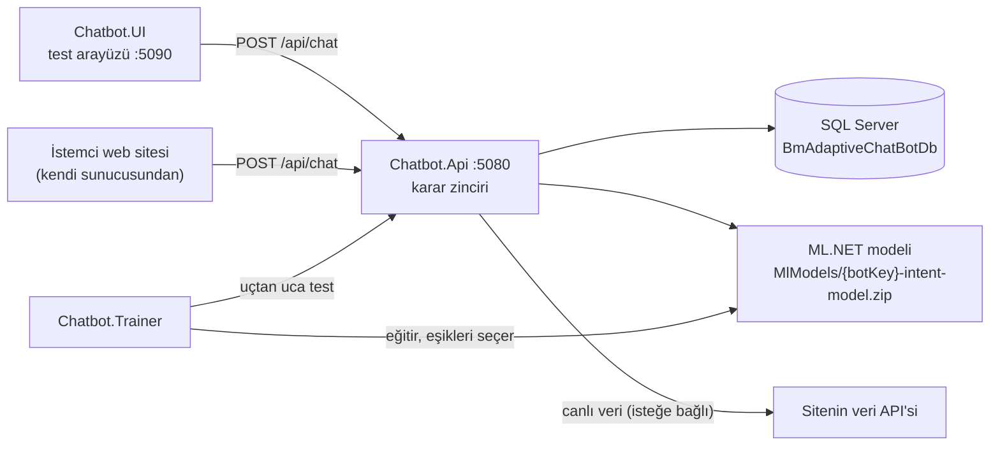

# BmAdaptiveChatBot

Farklı web sitelerine uyarlanabilen, Türkçe konuşan, intent tabanlı bir chatbot platformu.
Bir bot; cevapları, menüsü ve eğitim verisiyle tanımlanır. Aynı API birden fazla botu aynı anda
çalıştırır. Canlı veri gerektiren sorular (fiyat, stok gibi) isteğe bağlı olarak sitenin kendi API'sinden okunur.

Bu depo platformun boş hâlidir: içinde hazır bir bot, veri seti ya da eğitilmiş model yoktur.
Denemek için [`samples/`](samples/README.md) klasöründeki örnek botlardan biriyle başlayabilir ya da
kendi botunuzu ekleyebilirsiniz.

Kullanılan teknolojiler: .NET 10, ASP.NET Core Web API, Entity Framework Core + SQL Server, ML.NET, xUnit.

## Mimari



| Proje | Görevi |
|---|---|
| `Chatbot.Api` | Sohbet API'si. Mesajın hangi intent'e ait olduğuna karar verir ve cevabı veritabanından ya da harici bir veri sağlayıcıdan getirir. |
| `Chatbot.Trainer` | Bir botun eğitim verisinden ML.NET modelini eğitir, eşikleri ölçerek seçer ve çalışan API üzerinden uçtan uca test yapar. |
| `Chatbot.UI` | Geliştirme sırasında kullanılan test arayüzü. Her cevabın hangi adımda ve hangi skorla verildiğini gösterir. |
| `Chatbot.Tests` | Birim testleri (xUnit). |

## Çalıştırma

### Gereksinimler
- .NET 10 SDK
- SQL Server Express (`localhost\SQLEXPRESS`). Farklı bir sunucu için `Chatbot.Api/appsettings.json` içindeki `DefaultConnection` değiştirilir.

### 1. Bir bot ekleyin
Örnek otel botunu eklemek için (PowerShell, depo kök klasöründe):

```powershell
Copy-Item samples/hotel-demo/Chatbot.Api/Data/Seed/hotel-demo.json Chatbot.Api/Data/Seed/
Copy-Item -Recurse samples/hotel-demo/Chatbot.Trainer/Data/hotel-demo Chatbot.Trainer/Data/
```

Kendi botunuzu eklemek için [Yeni bir bot eklemek](#yeni-bir-bot-eklemek) bölümüne bakın.

### 2. Modeli eğitin
Model dosyaları depoda tutulmaz; her bot için bir kez eğitilir:

```
dotnet run --project Chatbot.Trainer -- hotel-demo
```

### 3. API'yi başlatın
```
dotnet run --project Chatbot.Api
```
API ilk açılışta veritabanını migration'larla oluşturur ve botların verisini `Chatbot.Api/Data/Seed/*.json` dosyalarından yükler.
Kontrol için: `http://localhost:5080/api/health?botKey=hotel-demo` → `"modelReady": true`

### 4. Test arayüzünü açın
```
dotnet run --project Chatbot.UI
```
`http://localhost:5090` bir test/debug arayüzüdür. Üstteki **Bot** listesi veritabanındaki bütün botları gösterir; bot değiştirilince yeni bir sohbet başlar. Sağdaki panel her cevabın intent'ini, karar adımını, skorunu ve botun model/veri sağlayıcısı bilgisini gösterir. Farklı bir API örneğini denemek için: `http://localhost:5090/?api=http://localhost:5081`

### Testler
```
dotnet test
```
Testler SQL Server, bot verisi ya da eğitilmiş model gerektirmez. API çalışırken `bin/Debug` klasörü kilitli olacağı için `dotnet test -c Release` kullanın.

## Yeni bir bot eklemek

1. `Chatbot.Api/Data/Seed/{botKey}.json` dosyasını oluşturun: bot bilgileri, cevaplar, menü, alias'lar. Örnekler `samples/*/Chatbot.Api/Data/Seed/` altındadır.
2. `Chatbot.Trainer/Data/{botKey}/training.tsv` ve `regression.tsv` dosyalarını hazırlayın (`Metin<TAB>Intent`). Regression cümleleri eğitimde geçmemelidir.
3. Modeli eğitin: `dotnet run --project Chatbot.Trainer -- {botKey}`
4. API'yi yeniden başlatın; bot veritabanına eklenir.

Sabit cevaplı bir bot için kod yazmak gerekmez. Canlı veri gerekiyorsa `IExternalDataProvider` arayüzünü uygulayan bir sağlayıcı yazılır, `Program.cs`'e kaydedilir ve `appsettings.json` → `ExternalData:BotProviders` altında bota bağlanır. Depodaki `NexoraCatalogProvider` böyle bir sağlayıcının örneğidir; nasıl bağlandığı [`samples/nexora-demo`](samples/nexora-demo/README.md) altında anlatılır.

## Bir mesaj nasıl cevaplanır?

Karar, `ChatbotService` içinde sırayla denenen küçük adımlardan oluşur. İlk sonuç veren adım kazanır:

| Sıra | Adım | Ne zaman karar verir? | Sonuç |
|---|---|---|---|
| 1 | Menü butonu | Kullanıcı bir seçeneğe tıkladı | Cevap |
| 2 | Birebir menü sorusu | Mesaj bir menü sorusunun aynısı | Cevap |
| 3 | Alias | Mesajda tek bir intent'e ait kesin bir ifade geçiyor ("şifremi unuttum") | Cevap |
| 4 | Bekleyen girdi | Bot bir önceki cevapta bilgi istemişti ("Hangi ürün?") | Cevap |
| 5 | Emin model | ML.NET modeli kalibre edilmiş eşiğin üstünde | Cevap |
| 6 | Takip sorusu | "peki bitişi?" gibi önceki konuya dönen kısa mesaj | Cevap |
| 7 | İki aday | Model iki intent arasında kaldı | İki seçenek |
| 8 | Kategori kelimesi | Mesajda bir konunun kelimesi geçiyor ("kargo") | O konunun seçenekleri |
| 9 | Adayın kategorisi | Model emin değil ama tek bir aday öne çıkıyor | O adayın konusu |
| 10 | Fallback | Hiçbiri | "Anlayamadım" mesajı |

Model 5. sırada, yani kısa mesaj ve takip sorusu kurallarından önce. Böylece "saat kaçta girebilirim?" gibi kendi başına anlamlı bir soru, içinde "kaçta" geçiyor diye önceki konuya bağlanmıyor. Bu kurallar yalnızca model emin olmadığında devreye giriyor.

Bot emin olmadığında tahmin yürütmek yerine seçenek sunar. Bu tasarım tercihi yanlış cevap oranını düşük tutar.

API yanıtı (örnek otel botundan):

```json
{
  "sessionId": "3f2a…",
  "message": "Şunlardan hangisini sormak istediniz?",
  "type": "options",
  "intent": null,
  "source": "top-two",
  "options": [
    { "title": "Kahvaltı saatleri nedir?", "intent": "BreakfastTime" },
    { "title": "Kahvaltı fiyata dahil mi?", "intent": "BreakfastIncluded" }
  ],
  "action": null,
  "debug": {
    "candidateIntent": "BreakfastTime",
    "score": 0.41,
    "margin": 0.08,
    "secondIntent": "BreakfastIncluded",
    "secondScore": 0.33,
    "usedExternalData": false
  }
}
```

`type` değerleri: `answer`, `question` (bot bir bilgi istiyor), `options`, `menu`, `fallback`. `source`, kararın verildiği adımı gösterir.

## Veritabanı

Botların bütün verisinin asıl kaynağı veritabanıdır. Şema EF Core migration'larıyla yönetilir (`Chatbot.Api/Data/Migrations`) ve API her açılışta en son migration'ı uygular.

| Tablo | İçerik |
|---|---|
| `BotProfiles` | Bot anahtarı, adı, karşılama, fallback ve menü başlığı |
| `KnowledgeArticles` | Intent → cevap metni |
| `HelpCategories`, `HelpCategoryAliases` | Menüdeki konular ve o konuyu işaret eden kelimeler |
| `MenuItems`, `MenuItemAliases` | Menüdeki sorular, bağlı oldukları intent ve alias'ları |
| `FollowUpPhrases` | Bota özel takip sorusu ifadeleri |
| `ConversationMessages` | Her mesaj ve verilen karar; oturum geçmişi buradan okunur |

`Data/Seed/{botKey}.json` dosyaları yalnızca boş bir veritabanını ilk kez doldurmak için kullanılır. Bir botun cevapları ya da menüsü veritabanında zaten varsa seeder onlara dokunmaz. Bu yüzden veritabanında yapılan bir düzenleme (yeni bir alias, düzeltilmiş bir cevap) kalıcıdır ve kod değişikliği ya da yeniden eğitim gerektirmez.

Yeni bir migration oluşturmak için:
```
dotnet tool restore
dotnet dotnet-ef migrations add <Ad> --project Chatbot.Api --output-dir Data/Migrations
```

## Model ve ölçüm

**Model.** Her bot için ayrı bir ML.NET çok sınıflı sınıflandırıcı: metin özellikleri (`FeaturizeText`) + `SdcaMaximumEntropy`. Metin eğitimde ve tahminde aynı şekilde normalize edilir (küçük harf, `ı ğ ü ş ö ç` → `i g u s o c`, noktalama temizliği).

**Eşik kalibrasyonu.** Modelin bir tahmine verdiği skor tek başına güvenilir değildir; intent sayısı arttıkça skorlar doğal olarak düşer. Bu yüzden eşikler sabit değil, her bot için ölçülerek seçilir:
1. Eğitim verisi 5 katlı çapraz doğrulamayla tahmin edilir: her cümle, onu hiç görmemiş bir modelle.
2. Eşikler, cevap verilen mesajların en az %97'si doğru kalacak şekilde en fazla mesaja cevap verecek biçimde seçilir (`--target-precision` ile değiştirilebilir).
3. Seçilen eşikler `MlModels/{botKey}-intent-model.thresholds.json` dosyasına yazılır, API bunları oradan okur.

**Uçtan uca test.** Eğitimde hiç kullanılmayan regression soruları çalışan API'ye gönderilir. Böylece yalnızca model değil, alias'lar ve seçenek sunma dahil kullanıcının gerçekte gördüğü sonuç ölçülür. Sonuç `Chatbot.Trainer/Data/{botKey}/e2e-report.json` dosyasına yazılır ve bir sonraki çalıştırmada öncekiyle karşılaştırılır.

```
dotnet run --project Chatbot.Trainer -- {botKey}                 # eğit + kalibre et + API açıksa test et
dotnet run --project Chatbot.Trainer -- {botKey} --e2e-only      # sadece uçtan uca test
```

API, trainer yeni bir model kaydettiğinde onu yeniden başlatılmadan yükler. Örnek botların ölçüm sonuçları [`samples/README.md`](samples/README.md) dosyasındadır.

## Bilinen sınırlar

- **Eğitim tam tekrarlanabilir değil.** SDCA birden fazla thread ile çalıştığı için aynı veriden eğitilen modeller ve seçilen eşikler çalıştırmadan çalıştırmaya biraz farklı çıkabiliyor.
- **Kimlik doğrulama yok.** `/api/chat` herkese açık; bot anahtarını bilen her istemci her botu çağırabilir. Bir siteye bağlarken istekler sitenin kendi sunucusu (proxy) üzerinden geçmelidir.
- **Gizli ayarlar düz metin.** Bir veri sağlayıcının API anahtarı `appsettings.json` içine yazılırsa düz metin olarak durur. Canlı ortamda user-secrets ya da ortam değişkeni kullanılmalı.
- **Konuşma kayıtları test verisi içerir.** Uçtan uca testin mesajları da `ConversationMessages` tablosuna yazılır; oturum kimlikleri `eval-` ile başladığı için ayırt edilebilir.
- **Kullanıcıya özel sorular yok.** Bot, sitede giriş yapmış kullanıcıyı tanımaz; "siparişim nerede" gibi sorulara yalnızca ilgili sayfanın bağlantısıyla cevap verebilir.

## Klasör yapısı

```
Chatbot.Api/
  Controllers/          ChatController, BotsController, HealthController
  Services/             ChatbotService (karar zinciri), IntentService (ML), BotMenuService, KnowledgeService
  Services/ExternalData/  IExternalDataProvider, örnek sağlayıcı NexoraCatalogProvider
  Data/                 AppDbContext, DbSeeder, Migrations/, Seed/ (botların seed dosyaları)
  Models/  Dtos/  Ml/
  MlModels/             eğitilmiş modeller (git dışında) ve eşik dosyaları
Chatbot.Trainer/
  Program.cs            eğitim akışı
  Evaluation/           eşik kalibrasyonu, uçtan uca test
  Data/{botKey}/        training.tsv, regression.tsv, e2e-report.json
Chatbot.UI/wwwroot/     test arayüzü
Chatbot.Tests/          birim testleri
samples/                örnek botlar (seed dosyaları ve veri setleri)
```
